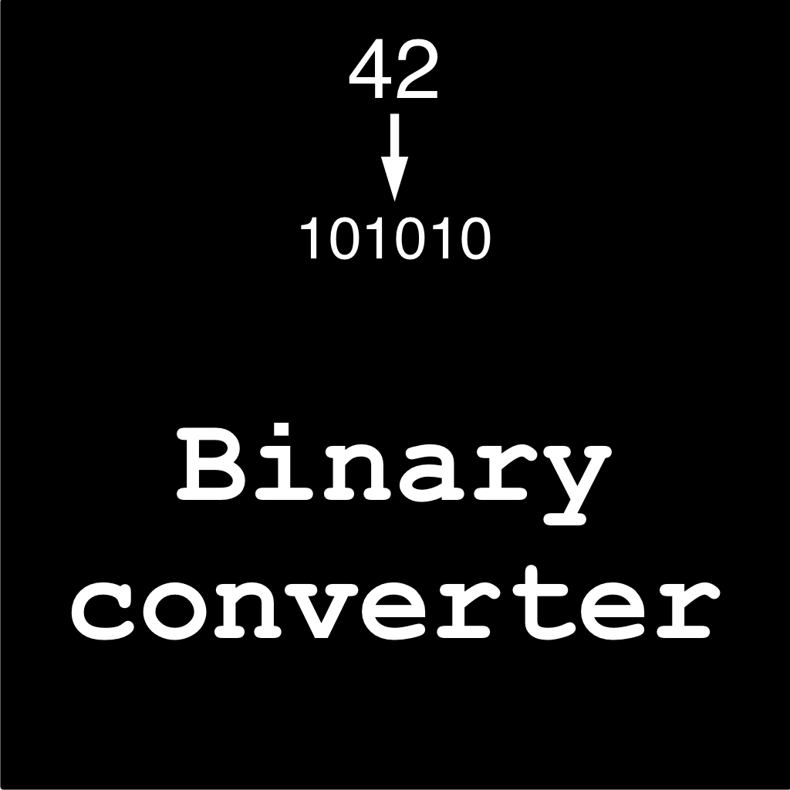
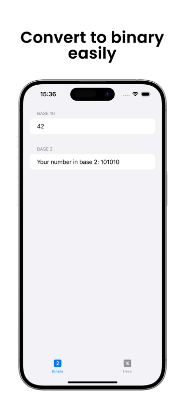
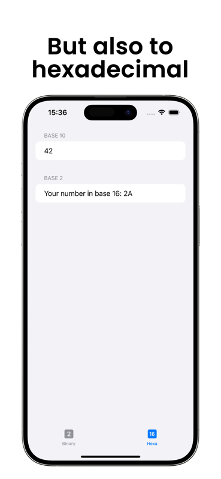

    
    <h1>Binary Converter</h1>

A simple hex converter for converting decimal to binary/hexadecimal and other base

    
    

## Download
https://apps.apple.com/fr/app/hexconverter/id6471345416